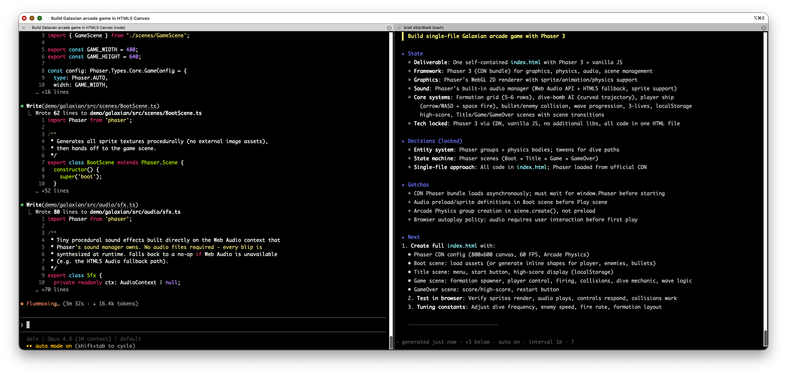

# Claude Brief — a live per-session summary brief beside your Claude Code terminal

[](LICENSE)
[](https://github.com/tigerquoll/claude-brief/releases)


I've been managing multiple concurrent Claude Code sessions for a while now, and I always
struggle a bit to get my bearings when I have a large number of sessions that have scrolled
into a wall of code and tool calls, and the thread gets lost — what path forward did I
decide for the sessions? What feature or bug is this screen working on? What's next?

The problem really compounds the more Claude Code sessions you have active at once -
every time you context-switch back to one, you cold-start — re-reading the transcript
to try and remember where it was and what it had already decided. A brief docked beside each
session turns that into a single glance, so tabbing between agents stops costing
you the thread.

**claude-brief** docks a per-session, auto-refreshing **brief** —
*State · Tried · Gotchas · Decisions · Next* — right beside your session, so that
thread is always one glance away instead of buried in the scrollback.

Each turn that does real work, a quick **Claude Haiku** call updates the brief;
trivial turns — no tool calls, barely any new output — are skipped, so it only spends
a cent or two when there's something new, and nothing when there isn't. The dock is
**pluggable**: iTerm2 (the most developed, as it's my daily driver), tmux,
kitty, WezTerm, ghostty, and Apple Terminal are auto-detected, with a generic fallback for anything else.

<p align="center">
  
  <br>
  <sub><i>The session (left) is a wall of code — the brief (right) keeps what's been <b>decided</b>, what's happening <b>now</b>, and what's <b>next</b> one glance away.</i></sub>
</p>

## Quick start

**As a Claude Code plugin (recommended)** — one command, hooks auto-wire (no `settings.json` editing):
```
/plugin marketplace add tigerquoll/claude-brief
/plugin install claude-brief@claude-brief
```
Then run **`/claude-brief:brief`** in any session.

> **Prereqs:** `bash ≥ 5` and `jq` are required (and `glow` for rich rendering). `/plugin install`
> runs no dependency check, so install them first — `brew install bash jq glow` — otherwise the dock
> just flags whatever's missing at session start. Details: [Requirements](#requirements).

**Or install into `~/.claude`** (no plugin system; the command stays `/brief`). Pick *one*
of these — the plugin and `install.sh` wire the same hooks, so running both double-fires:
```bash
curl -fsSL https://github.com/tigerquoll/claude-brief/releases/latest/download/claude-brief.tar.gz \
  | tar xz && cd claude-brief-*/ && ./install.sh
```
Add three hook lines to `~/.claude/settings.json` (it's kept out of the repo so no
config leaks):
```
UserPromptSubmit -> bash "$HOME/.claude/hooks/task-prompt-hook.sh"
Stop             -> bash "$HOME/.claude/hooks/task-summary-hook.sh"
SessionEnd       -> bash "$HOME/.claude/hooks/session-end-hook.sh"
```
Then run **`/brief`** in any Claude Code session. Full details in
[Install & setup](#install--setup); deps in [Requirements](#requirements).

**Developing or hacking on it?** Clone instead — that installs your working checkout:
```bash
git clone https://github.com/tigerquoll/claude-brief.git && cd claude-brief && ./install.sh
```
Architecture, the driver contract, adding a terminal → **[DEVELOPING.md](DEVELOPING.md)**.

## Commands
- **`/brief`** — open/refocus a docked split showing this session's live brief
  (State · Tried · Gotchas · Decisions · Next). `/brief float` = separate window;
  `/brief refresh` = regenerate the brief now instead of next turn;
  `/brief close` = tear the dock down (clean, no-prompt close on every backend).

  In the dock: `r` refresh now · `a` toggle end-of-turn auto-refresh · `i` toggle
  periodic refresh · `+`/`-` interval · `?` keys · `q` close.

## How it works
A **`Stop`** hook runs a cheap Haiku summary each completed turn (cost-gated: it
skips trivial turns) and writes `~/.claude/state/<sid>.brief.md`. `/brief` opens a
docked split (or a companion window) running the live viewer beside your session; it
auto-refreshes at the end of each turn. A **`SessionEnd`** hook closes the dock and
deletes that session's state, so nothing lingers on disk.

**Privacy — what each summary call sends:** a display-size directive, the
conversation title, the previous brief, your latest prompt, and the recent
conversation (the last ~14 user/assistant message **text** blocks, truncated to a
few KB). Tool calls and their outputs are **stripped**, so raw file contents /
command output are not sent (though the assistant's prose may quote paths, code, or
errors). It goes to the same gateway Claude Code already uses — or wherever you point
`$BRIEF_SUMMARIZER` (see [Customizing the summary model](#customizing-the-summary-model)).

## Terminals
Auto-detected; force one with `BRIEF_TERMINAL=<name>`. Most need no setup — a few do:

- **iTerm2** (macOS) — real in-window split. No setup; the best-tested backend, as it's my daily driver.
- **WezTerm** (macOS/Linux) — real split via `wezterm cli`, **no config and no tty
  needed** (the dock split refocuses your session pane). No setup.
- **tmux** (macOS/Linux) — real split inside any host terminal (incl. Apple
  Terminal); wins detection when `$TMUX` is set. No setup.
- **ghostty** (macOS) — real in-window split via AppleScript; **first `/brief` needs
  a one-time macOS Automation approval**.
- **Apple Terminal** (macOS) — no scriptable split panes, so the dock is a companion
  window beside the main one; first run needs the Automation approval.
- **kitty** (macOS/Linux) — needs **socket remote control** (because `/brief` has no
  controlling tty, a tty-only setup can't be reached). Add to `kitty.conf`, then
  **restart kitty**:
  ```
  allow_remote_control yes
  listen_on unix:/tmp/kitty
  enabled_layouts splits,stack
  ```
- **Tabby** — *manual dock only.* Tabby has no scriptable split, no targetable/closable
  CLI, and no AppleScript, so `/brief` can't auto-dock — it prints split-it-yourself
  instructions and the `brief-view.sh <sid>` command. (A true dock would need a Tabby
  plugin.)
- **Anything else → generic** — `/brief` prints the `brief-view.sh <sid>` command for
  you to run in a split you open yourself.

## Dock styling
**1.2× line spacing** noticeably improves reading the brief *at a glance* — the extra
breathing room lets you take in State · Decisions · Next in a single look rather than
line by line. That's why the dock leans on it, and why iTerm2 (my daily driver) gets
the most complete treatment: it can scope that spacing to **just the dock**, leaving
your session pane untouched. The snag is that most other terminals can't control line
spacing per-pane at all — so reproducing this elsewhere ranges from a global-only
compromise to outright impossible, as the table below lays out.

The dock can use a **`brief` profile** = your profile + 1.2× line spacing. iTerm2
ships `iterm2/DynamicProfiles/brief.json` (auto-loaded; inherits your Default profile
*live*). Apple Terminal generates one at install via `bin/brief-term-profile.sh` —
from the profile you install *from* — and imports it once (Terminal can't inherit or
auto-load, so it's a snapshot; re-run the helper to refresh).

Only iTerm2 and Apple Terminal can give the dock its **own** profile; every other
backend can at most widen line spacing **globally** (which also affects your session
pane). What each backend can scope to just the dock:

| Backend | Dock-scoped line spacing *(the `brief` profile's whole point)* | Other per-pane styling it can do | Global ~1.2× spacing lever |
|---|---|---|---|
| **iTerm2** | ✅ DynamicProfile (live-inherits Default) | full `brief` profile | — (built in) |
| **Apple Terminal** | ✅ imported `.terminal` snapshot | full `brief` profile | — (built in) |
| **ghostty** | ❌ no line-height key/action | per-surface font **size** only | `adjust-cell-height = 20%` |
| **kitty** | ❌ font metrics are global | per-window **colors** (`kitty @ set-colors`) | `modify_font cell_height 120%` |
| **WezTerm** | ❌ one global config | none via the CLI | `config.line_height = 1.2` |
| **tmux** | ❌ shares the host terminal's font | none — can't change the font at all | (host terminal's font) |

So **kitty, WezTerm, ghostty, and tmux all hit the same wall**: no dock-scoped
`brief` spacing — the global lever (last column) is the only workaround, and it
widens your session pane too. `$BRIEF_PROFILE` overrides the profile name (iTerm2 /
Apple Terminal); `$BRIEF_FONT_BUMP=N` (Apple Terminal) also enlarges the font.

**Unfocused-pane dimming** is a global app setting, not a dock profile, so you set it
once yourself: on **iTerm2** uncheck Settings ▸ Appearance ▸ Dimming ▸ *Dim inactive
split panes* (otherwise the dock fades while you type in the session pane); on
**ghostty** add `unfocused-split-opacity = 1` to `~/.config/ghostty/config` (plus
`adjust-cell-height = 20%` for ~1.2× spacing); on **kitty** add
`modify_font cell_height 120%` to `~/.config/kitty/kitty.conf` (reload with
ctrl+shift+f5); on **WezTerm** set `config.line_height = 1.2` in `~/.wezterm.lua`.
These are global — none of these terminals can scope them to just the dock.

## Customizing the summary model
By default the brief is a Haiku `claude -p` call on the same gateway Claude Code
uses. Two opt-ins:
- **Cheaper, API-direct path:**
  `export BRIEF_SUMMARIZER=~/.claude/bin/brief-summarize-api.sh` calls the Anthropic
  Messages API directly — skips the CLI's ~30k-token prefix, ~5× cheaper. Configure
  it **independently of the main session** via `BRIEF_API_BASE` / `BRIEF_API_TOKEN` /
  `BRIEF_API_MODEL` (these override the shared `ANTHROPIC_*`), or put them in
  `~/.claude/brief-summarizer.env` (`chmod 600`) to keep the token out of
  settings.json and the main session's environment.
- **Your own model/script:** point `$BRIEF_SUMMARIZER` at a script under `~/.claude/`
  — contract in [DEVELOPING.md](DEVELOPING.md#the-summariser-contract).

## Requirements
bash ≥ 5 for the dock viewer (`brew install bash`) · `jq` · `perl` (built-in) · the
`claude` CLI · **one terminal** from [Terminals](#terminals) above. Optional: `glow`
(`brew install glow`) renders the brief best; `bat` is a lighter fallback (highlighted
source, not fully rendered); with neither, it's plain text. The hooks + drivers
themselves are bash-3.2-safe. `./install.sh` checks these up front; installed as a plugin,
the SessionStart hook flags anything missing (required deps keep flagging until installed).

## Install & setup
> **Using the plugin?** Skip this section. `/plugin install` wires the hooks and copies the
> iTerm2 profile for you — there's no `install.sh` step and nothing to add to `settings.json`.
> The steps below are the **manual `~/.claude` install** (the clone path), used only when
> you're *not* using the plugin system.

- `./install.sh` — runs a **dependency check**, then copies repo → `~/.claude` (+ the
  iTerm2 profile). Exits non-zero if a required dep is missing. Use to restore or set
  up a new machine.
- `./install.sh --check` — run only the dependency check (reports which terminals are
  available and the one auto-detected here); install nothing.
- Add the hook entries to `~/.claude/settings.json` **by hand** (it isn't committed,
  to avoid leaking config):
  ```
  UserPromptSubmit -> bash "$HOME/.claude/hooks/task-prompt-hook.sh"
  Stop             -> bash "$HOME/.claude/hooks/task-summary-hook.sh"
  SessionEnd       -> bash "$HOME/.claude/hooks/session-end-hook.sh"
  ```

Contributing or porting (`./test.sh`, ShellCheck, the driver guide) →
**[DEVELOPING.md](DEVELOPING.md)**.

## Prior art & comparison
There's an active ecosystem of "what is each of my sessions doing" tools. They
split along three axes: **what** they surface (a model-written brief vs. a raw
status/event feed vs. usage metrics), **where** it renders (a docked terminal
pane vs. the tmux status bar vs. a web dashboard vs. an in-app list), and whether
they pay for a **per-turn model summary**. No tool I'm aware of combines all of
this project's choices — a *structured, model-written brief*, *cost-gated*, in a
*docked pane with pluggable terminal backends*.

| Project | What it surfaces | Where it renders | Per-turn model brief | Terminal scope |
|---|---|---|---|---|
| **claude-brief** (this) | Structured brief — State · Tried · Gotchas · Decisions · Next | **Docked pane** beside the session | ✅ Haiku, cost-gated; pluggable + API-direct path | iTerm2 · tmux · kitty · WezTerm · ghostty · Apple Terminal (+ generic) |
| [Quickchat AI — tmux summaries][pa-quickchat] | 2–3 sentence summary | tmux **status bar** (2-line) | ✅ Haiku via `claude -p`, no gating | tmux only |
| [tmux-agent-sidebar][pa-sidebar] | Raw activity: prompts, tool calls, wait reason, subagent tree, git/worktrees | Docked **tmux sidebar** | ❌ monitor only | tmux 3.0+ |
| [tmux-agent-status][pa-status] | Working / idle / done / parked + fzf jumper | tmux sidebar + status line | ❌ | tmux |
| [Claude Code Agent View][pa-agentview] (official) | Session list: last response, waiting?, timestamp; needs-you floats to top | In-app **CLI list** | ❌ shows last message | in-app (any terminal) |
| [multi-agent observability][pa-observe] & forks | 12 lifecycle hook events, optional tool-I/O summary | **Web dashboard** | ⚠️ optional `--summarize` | web (browser) |
| [claude-code-monitor][pa-monitor] | Status icons + last messages + focus-switch | TUI + **mobile web** | ❌ | iTerm2 / Terminal / Ghostty (focus) |
| [ccusage][pa-ccusage] / [claude-statusline][pa-statusline] | Context % · cost · branch | bottom **status line** | ❌ | in-app |

- **Closest in mechanism:** *Quickchat AI's tmux summaries* — same `Stop` hook →
  Haiku → glanceable summary path. It renders a one-liner into a 2-line tmux
  status bar (vs. this project's full structured brief in a real pane), is
  tmux-only, and has no cost gating or API-direct cheaper path.
- **Closest in form factor:** *tmux-agent-sidebar* — a real docked pane you tab
  to, but it's a **monitor** (raw prompts/tool-calls/status), not a model-written
  brief, and tmux-only.
- **Official / first-party:** *Agent View* and the desktop app's recap solve the
  same re-orientation problem at the fleet level (a list of last-messages, sorted
  by who needs you) rather than a per-session brief docked beside the work.
- **Different paradigm:** the observability dashboards stream granular hook events
  to a browser — telemetry, not a glanceable "where was I" brief in the terminal.

## License

BSD 3-Clause — see [LICENSE](LICENSE). © 2026 Dale &lt;tigerquoll@outlook.com&gt;.

[pa-quickchat]: https://quickchat.ai/post/tmux-session-summaries-for-parallel-ai-agents
[pa-sidebar]: https://github.com/hiroppy/tmux-agent-sidebar
[pa-status]: https://github.com/samleeney/tmux-agent-status
[pa-agentview]: https://claudefa.st/blog/guide/agents/agent-view
[pa-observe]: https://github.com/disler/claude-code-hooks-multi-agent-observability
[pa-monitor]: https://github.com/onikan27/claude-code-monitor
[pa-ccusage]: https://ccusage.com/guide/statusline
[pa-statusline]: https://felipeelias.github.io/2026/03/17/claude-statusline.html
